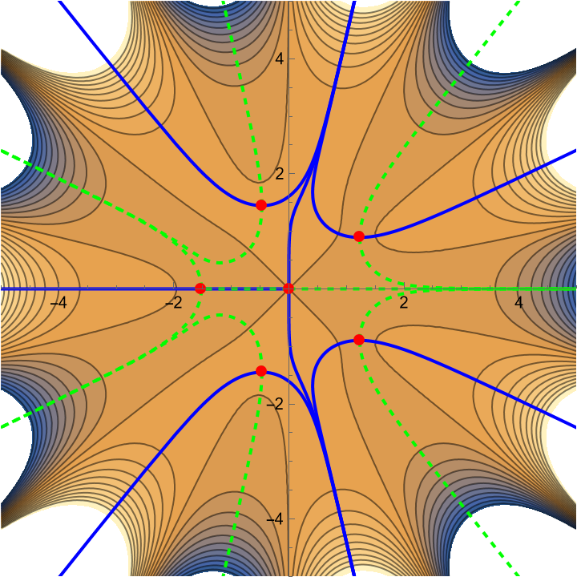

# Lefschetz Thimble Plotter (Mathematica)

Flow-based Mathematica visualiser for Lefschetz thimbles and dual thimbles in 1D complex integrals (Picard–Lefschetz theory).

## What this does
- Finds saddle points by solving W'(z)=0.
- Traces thimbles and dual thimbles via holomorphic gradient flow.
- Optional speed-normalised flow prevents runaway for high-degree potentials (e.g. z^9, z^11).

## Quick start
1. Open `src/thimble_plotter.wl` in Mathematica.
2. Set `p`, `deltaParam`, and `box` near the top of the file.
3. Evaluate the script.

<<<<<<< HEAD
\## Maths notes

See \[`docs/maths.md`](docs/maths.md) for the flow equations and thimble/dual definitions.

=======
## Notes
- Assumes non-degenerate saddles (W''(zσ) ≠ 0).
- If arms “disappear”, enlarge `box` and/or keep `useNormalisedFlow = True`.
>>>>>>> f99eedb191e09544bad5fd903bb699a9ad6edb19

## Licence
MIT.

